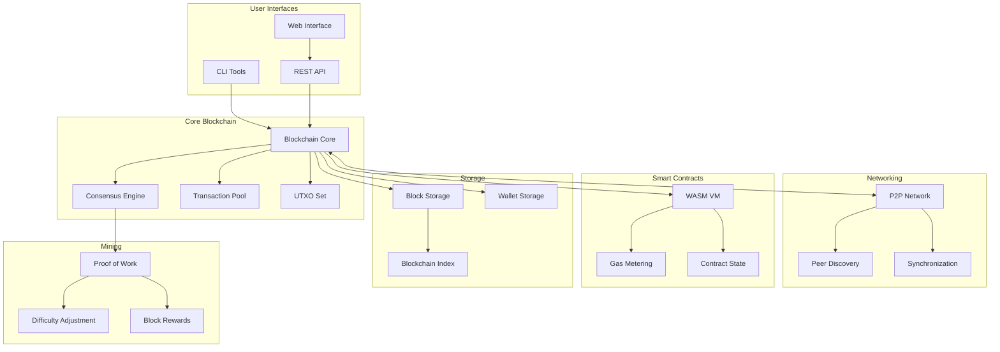
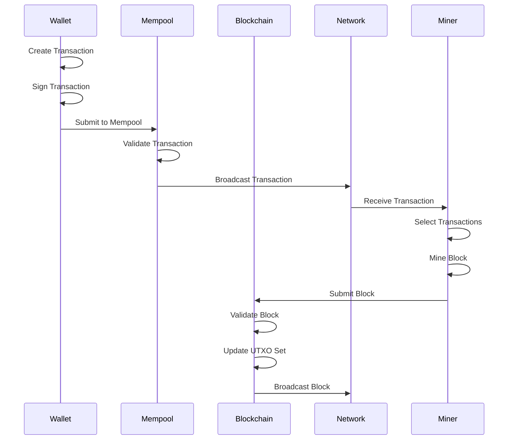
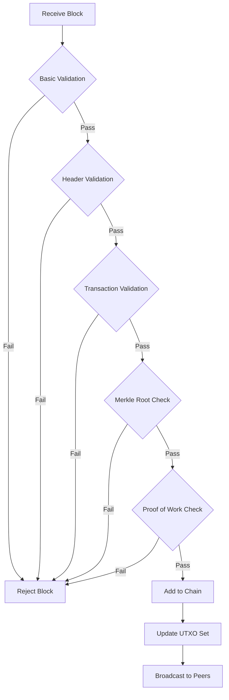
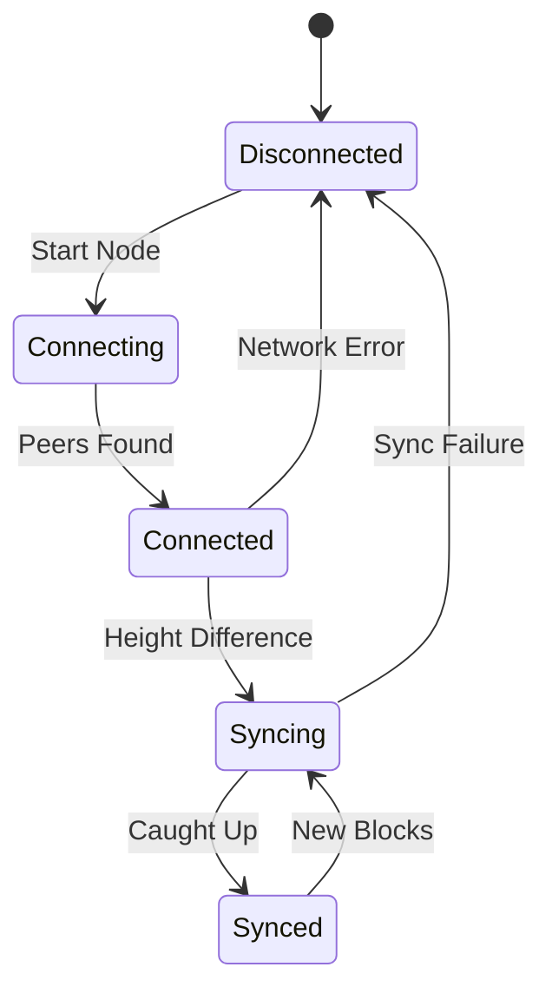

# Blockchain Architecture Documentation

## System Overview

This document provides a comprehensive overview of the blockchain architecture, detailing how different components interact to create a functional distributed ledger system.

## High-Level Architecture



## Core Components

### 1. Blockchain Core (`src/blockchain.rs`)

The blockchain core manages the main chain state and coordinates all blockchain operations.

**Key Responsibilities:**
- Block validation and storage
- Chain state management
- Transaction processing
- UTXO set updates
- Difficulty adjustment

**Data Structures:**
```rust
pub struct Blockchain {
    config: BlockchainConfig,
    db: BlockchainDB,
    state: ChainState,
    utxo_set: UTXOSet,
    mempool: Mempool,
    blocks_by_hash: HashMap<String, Block>,
    blocks_by_height: HashMap<u64, String>,
}
```

**Key Methods:**
- `add_block()` - Validates and adds new blocks
- `validate_block()` - Comprehensive block validation
- `get_chain_stats()` - Returns current chain statistics
- `calculate_next_difficulty()` - Adjusts mining difficulty

### 2. Cryptography (`src/crypto.rs`)

Handles all cryptographic operations using industry-standard algorithms.

**Features:**
- secp256k1 elliptic curve cryptography
- SHA-256 and double SHA-256 hashing
- Digital signature creation and verification
- Key pair generation and management

**Security Considerations:**
- Uses cryptographically secure random number generation
- Implements proper key derivation
- Follows Bitcoin-compatible signature formats

### 3. Transaction System (`src/transaction.rs`)

Implements a UTXO-based transaction model similar to Bitcoin.

**Transaction Flow:**
1. Transaction creation with inputs/outputs
2. Digital signature generation
3. Transaction validation
4. UTXO set updates
5. Confirmation in blocks

**Validation Rules:**
- Input availability verification
- Signature validation
- Balance checks
- Double-spending prevention
- Fee calculation

### 4. UTXO Management (`src/utxo.rs`)

Manages the set of unspent transaction outputs for efficient balance tracking.

**Optimization Features:**
- Address indexing for fast balance queries
- Efficient UTXO selection algorithms
- Coinbase maturity tracking
- Serialization for persistence

### 5. Peer-to-Peer Network (`src/network.rs`)

Built on libp2p for modern, secure networking.

**Network Protocols:**
- **Gossipsub**: Message broadcasting
- **Kademlia**: Distributed hash table for peer discovery
- **mDNS**: Local network discovery
- **Identify**: Peer information exchange
- **Request-Response**: Direct peer communication

**Message Types:**
- Block announcements
- Transaction propagation
- Peer discovery
- Chain synchronization requests

### 6. Mining System (`src/mining.rs`)

Implements proof-of-work consensus with adjustable difficulty.

**Mining Process:**
1. Transaction selection from mempool
2. Merkle tree construction
3. Block header creation
4. Nonce iteration with multi-threading
5. Difficulty target verification
6. Block broadcast

**Difficulty Adjustment:**
- Targets 10-minute block times
- Adjusts every 2016 blocks
- Prevents extreme difficulty swings

### 7. Smart Contract VM (`src/smart_contracts.rs`)

WebAssembly-based virtual machine for contract execution.

**Features:**
- WASM runtime with Wasmtime
- Gas metering for DoS protection
- Contract state persistence
- Host function interface

**Gas Mechanism:**
- Computation cost tracking
- Configurable gas limits
- Out-of-gas protection
- Gas price markets

### 8. Wallet System (`src/wallet.rs`, `src/bip39_wallet.rs`)

Comprehensive wallet functionality with modern standards.

**Wallet Types:**
- Basic wallets with random key generation
- BIP39 hierarchical deterministic wallets
- Multi-signature wallet support (planned)

**Security Features:**
- Mnemonic phrase backup
- Deterministic key derivation
- Address validation
- Transaction signing

### 9. Memory Pool (`src/mempool.rs`)

Manages pending transactions awaiting confirmation.

**Features:**
- Fee-based transaction prioritization
- Transaction validation before inclusion
- Configurable size limits
- Automatic cleanup of expired transactions

### 10. Persistence Layer (`src/persistence.rs`)

RocksDB-based storage for blockchain data.

**Storage Organization:**
- Column families for different data types
- Efficient key-value storage
- Atomic updates for consistency
- Backup and restore capabilities

## Data Flow

### Transaction Lifecycle



### Block Validation Process



### Network Synchronization



## Security Architecture

### Cryptographic Security

1. **Hash Functions**
   - SHA-256 for all hashing operations
   - Double SHA-256 for block headers
   - Merkle tree construction

2. **Digital Signatures**
   - secp256k1 elliptic curve
   - ECDSA signature algorithm
   - Message hashing before signing

3. **Key Management**
   - Secure random number generation
   - BIP32 hierarchical deterministic wallets
   - BIP39 mnemonic phrases

### Network Security

1. **Peer Authentication**
   - Public key-based peer identification
   - Encrypted communications
   - Message authentication

2. **DoS Protection**
   - Rate limiting on connections
   - Resource usage monitoring
   - Automatic peer disconnection

3. **Data Integrity**
   - Cryptographic hashes for all data
   - Merkle tree proofs
   - Chain validation

### Consensus Security

1. **Proof of Work**
   - Computational cost for block creation
   - Difficulty adjustment mechanism
   - Chain selection rules

2. **Transaction Validation**
   - UTXO double-spending prevention
   - Signature verification
   - Balance validation

## Performance Considerations

### Scalability Limitations

1. **Transaction Throughput**
   - Block size limits (1MB)
   - Block time targets (10 minutes)
   - UTXO set growth

2. **Storage Requirements**
   - Full blockchain history
   - UTXO set storage
   - Index maintenance

3. **Network Bandwidth**
   - Block propagation delays
   - Transaction broadcasting
   - Peer synchronization

### Optimization Strategies

1. **Database Optimization**
   - RocksDB tuning parameters
   - Efficient key encoding
   - Read/write optimization

2. **Memory Management**
   - UTXO caching strategies
   - Memory pool limits
   - Garbage collection

3. **Network Optimization**
   - Compression algorithms
   - Efficient serialization
   - Connection pooling

## Configuration Management

### Blockchain Parameters

```rust
pub struct BlockchainConfig {
    pub network: String,
    pub genesis_timestamp: DateTime<Utc>,
    pub genesis_difficulty: u32,
    pub max_block_size: usize,
    pub target_block_time: u64,
    pub difficulty_adjustment_interval: u64,
}
```

### Network Configuration

```rust
pub struct NetworkConfig {
    pub listen_addresses: Vec<Multiaddr>,
    pub bootstrap_peers: Vec<Multiaddr>,
    pub max_connections: usize,
    pub connection_timeout: Duration,
}
```

### Mining Configuration

```rust
pub struct MiningConfig {
    pub max_threads: usize,
    pub target_difficulty: u32,
    pub miner_address: String,
    pub extra_nonce: u64,
}
```

## Monitoring and Metrics

### Key Metrics

1. **Blockchain Metrics**
   - Chain height
   - Total difficulty
   - UTXO set size
   - Transaction count

2. **Network Metrics**
   - Connected peers
   - Message rates
   - Bandwidth usage
   - Sync status

3. **Mining Metrics**
   - Hash rate
   - Block discovery rate
   - Difficulty changes
   - Reward distribution

4. **Performance Metrics**
   - Block validation time
   - Transaction processing rate
   - Database performance
   - Memory usage

### Logging Strategy

```rust
// Log levels and categories
TRACE: Detailed execution flow
DEBUG: Development debugging
INFO:  General operation info
WARN:  Warning conditions
ERROR: Error conditions
```

## Future Enhancements

### Planned Features

1. **Light Client Support**
   - SPV (Simplified Payment Verification)
   - Merkle proofs for transactions
   - Reduced storage requirements

2. **Advanced Scripting**
   - More complex transaction scripts
   - Multi-signature transactions
   - Time-locked transactions

3. **Layer 2 Solutions**
   - Payment channels
   - State channels
   - Sidechains

4. **Privacy Features**
   - Confidential transactions
   - Ring signatures
   - Zero-knowledge proofs

### Performance Improvements

1. **Database Optimizations**
   - UTXO commitment schemes
   - Pruning strategies
   - Parallel validation

2. **Network Improvements**
   - Compact block relay
   - Transaction relay optimization
   - Improved peer selection

3. **Smart Contract Enhancements**
   - Better gas pricing
   - Contract upgradability
   - Cross-contract calls

This architecture provides a solid foundation for a functional blockchain while maintaining clarity and extensibility for future enhancements.