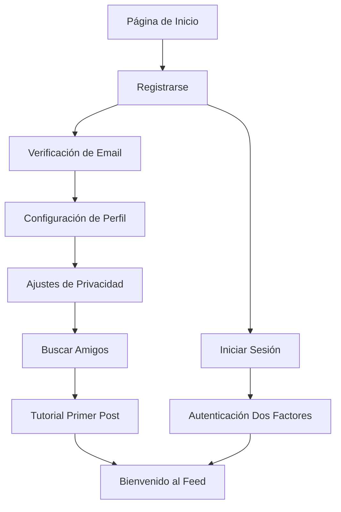
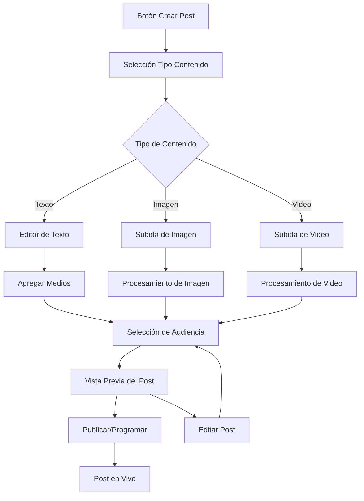
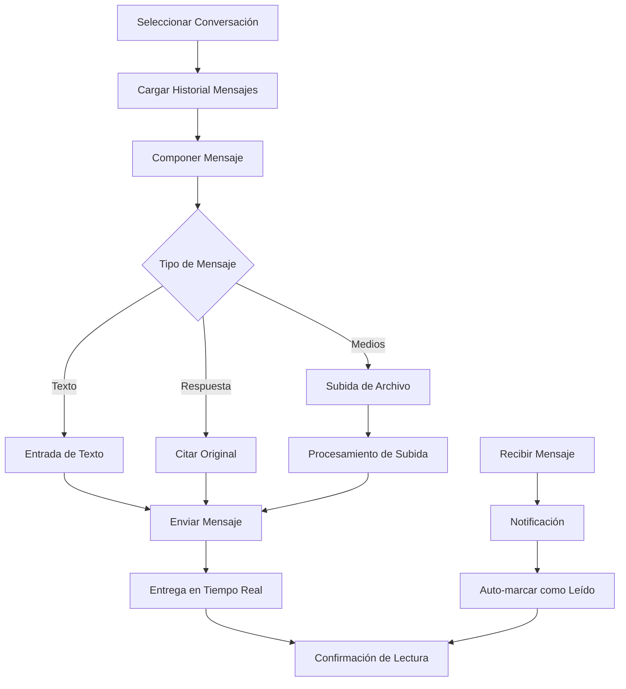
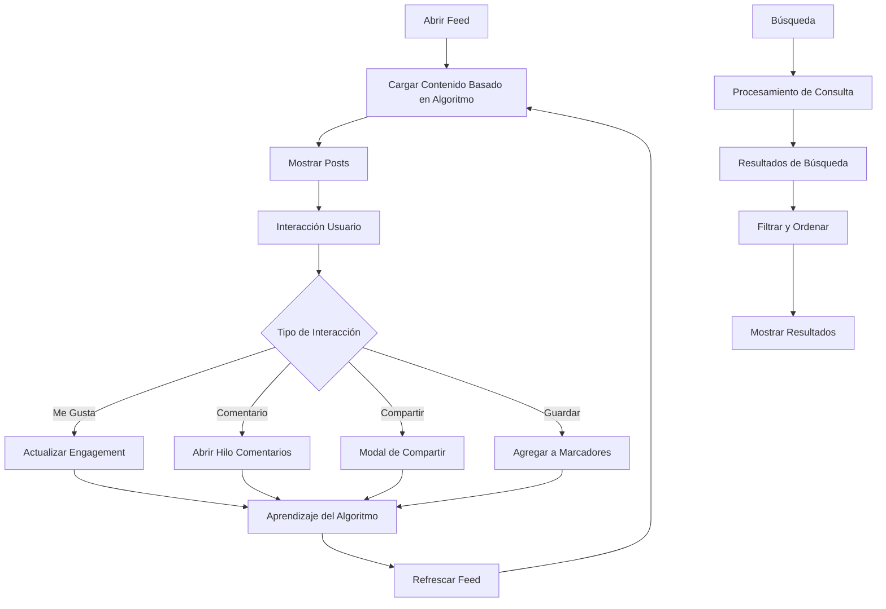

# SocialConnect - Documentación Funcional

## Índice

1. [Resumen General](#resumen-general)
2. [Roles de Usuario y Permisos](#roles-de-usuario-y-permisos)
3. [Características Principales](#características-principales)
4. [Flujos de Trabajo del Usuario](#flujos-de-trabajo-del-usuario)
5. [Lógica de Negocio](#lógica-de-negocio)
6. [Interfaz de Usuario](#interfaz-de-usuario)
7. [Gestión de Contenido](#gestión-de-contenido)
8. [Privacidad y Seguridad](#privacidad-y-seguridad)
9. [Interacciones Sociales](#interacciones-sociales)
10. [Comunicación en Tiempo Real](#comunicación-en-tiempo-real)
11. [Sistema de Notificaciones](#sistema-de-notificaciones)
12. [Moderación de Contenido](#moderación-de-contenido)
13. [Analíticas e Informes](#analíticas-e-informes)
14. [Experiencia Móvil](#experiencia-móvil)
15. [Accesibilidad](#accesibilidad)

## Resumen General

SocialConnect es una plataforma de redes sociales integral diseñada para facilitar conexiones significativas, compartir contenido y comunicación en tiempo real entre usuarios. La plataforma enfatiza la privacidad del usuario, la calidad del contenido y la construcción de comunidades a través de tecnologías web modernas y experiencias de usuario intuitivas.

### Misión de la Plataforma
- **Conectar**: Permitir a los usuarios construir y mantener conexiones sociales
- **Compartir**: Proporcionar capacidades ricas de creación y compartir contenido
- **Involucrar**: Fomentar interacciones significativas y engagement comunitario
- **Proteger**: Asegurar la privacidad del usuario y seguridad de datos
- **Innovar**: Entregar características de redes sociales de vanguardia

### Audiencia Objetivo
- **Primaria**: Entusiastas de redes sociales de 16-45 años
- **Secundaria**: Creadores de contenido e influencers
- **Terciaria**: Empresas y organizaciones que buscan presencia social

## Roles de Usuario y Permisos

### Tipos de Usuario

#### 1. Usuario Regular
**Permisos:**
- Crear y gestionar perfil personal
- Publicar contenido (texto, imágenes, videos)
- Compartir historias con expiración de 24 horas
- Dar me gusta, comentar y compartir posts
- Seguir/dejar de seguir otros usuarios
- Enviar y recibir mensajes directos
- Unirse a conversaciones grupales
- Marcar posts para ver más tarde
- Reportar contenido inapropiado
- Personalizar configuraciones de privacidad

**Limitaciones:**
- No puede acceder a características de administrador
- Limitado a cuotas estándar de publicación
- No puede moderar contenido comunitario

#### 2. Usuario Verificado
**Permisos Adicionales:**
- Insignia verificada en el perfil
- Visibilidad mejorada en resultados de búsqueda
- Soporte al cliente prioritario
- Acceso a analíticas avanzadas
- Límites de publicación más altos

**Requisitos:**
- Proceso de verificación de identidad
- Umbral mínimo de seguidores
- Cuenta en buen estado

#### 3. Creador de Contenido
**Permisos Adicionales:**
- Acceso al estudio del creador
- Analíticas avanzadas de contenido
- Características de monetización (futuro)
- Capacidades de transmisión en vivo (futuro)
- Herramientas de colaboración

#### 4. Administrador
**Permisos Completos:**
- Gestión de cuentas de usuario
- Moderación de contenido
- Configuración de plataforma
- Acceso al panel de analíticas
- Monitoreo del sistema

### Matriz de Permisos

| Característica | Usuario Regular | Usuario Verificado | Creador | Admin |
|----------------|------------------|-------------------|---------|-------|
| Creación de Perfil | ✅ | ✅ | ✅ | ✅ |
| Publicar Contenido | ✅ | ✅ | ✅ | ✅ |
| Historias | ✅ | ✅ | ✅ | ✅ |
| Mensajería | ✅ | ✅ | ✅ | ✅ |
| Analíticas Avanzadas | ❌ | ✅ | ✅ | ✅ |
| Insignia de Verificación | ❌ | ✅ | ✅ | ✅ |
| Moderación de Contenido | ❌ | ❌ | ❌ | ✅ |
| Gestión de Usuarios | ❌ | ❌ | ❌ | ✅ |
| Configuración del Sistema | ❌ | ❌ | ❌ | ✅ |

## Características Principales

### 1. Gestión de Usuarios
**Registro y Autenticación**
- Registro basado en email con verificación
- Validación de unicidad de nombre de usuario
- Requisitos de contraseña segura
- Opciones de login social (Google, Facebook) - *Futuro*
- Autenticación de dos factores - *Futuro*
- Restablecimiento de contraseña vía email

**Gestión de Perfil**
- Información personal (nombre para mostrar, bio, ubicación)
- Subida de foto de perfil y portada
- Configuración de ajustes de privacidad
- Proceso de verificación de cuenta
- Controles de visibilidad del perfil

### 2. Creación y Compartir Contenido
**Posts**
- Contenido de texto enriquecido con formateo
- Subida múltiple de imágenes (hasta 10 por post)
- Subida de videos con compresión
- Vistas previas de enlaces con metadatos
- Configuraciones de visibilidad de posts (Público, Amigos, Privado)
- Programación de contenido - *Futuro*
- Edición y eliminación de posts

**Historias**
- Contenido que desaparece en 24 horas
- Historias de imagen y video
- Seguimiento de visualizadores de historias
- Destacados de historias - *Futuro*
- Reacciones a historias - *Futuro*

**Manejo de Medios**
- Optimización automática de imágenes
- Compresión de video y miniaturas
- Carga progresiva de imágenes
- Soporte multi-formato (JPEG, PNG, WebP, MP4, etc.)

### 3. Interacciones Sociales
**Características de Engagement**
- Me gusta/no me gusta en posts y comentarios
- Comentarios con respuestas anidadas
- Compartir posts (interno y externo)
- Marcadores de contenido
- Emojis de reacción - *Futuro*

**Conexiones Sociales**
- Seguir/dejar de seguir usuarios
- Detección de seguidores mutuos
- Algoritmo de sugerencias de amigos
- Bloqueo y reporte de usuarios
- Listas de siguiendo/seguidores

### 4. Comunicación en Tiempo Real
**Mensajería Directa**
- Conversaciones uno a uno
- Mensajería grupal (hasta 50 participantes)
- Compartir medios en mensajes
- Reacciones a mensajes - *Futuro*
- Mensajes de voz - *Futuro*
- Videollamadas - *Futuro*

**Características en Vivo**
- Indicadores de escritura
- Indicadores de estado en línea
- Confirmaciones de lectura de mensajes
- Notificaciones en tiempo real
- Visualización de historias en vivo

### 5. Descubrimiento y Búsqueda
**Descubrimiento de Contenido**
- Algoritmo de feed personalizado
- Posts y hashtags en tendencia
- Recomendaciones de usuarios
- Categorías de contenido
- Spotlight de creadores populares

**Funcionalidad de Búsqueda**
- Búsqueda de usuarios por nombre de usuario o nombre para mostrar
- Búsqueda de contenido con filtros
- Exploración de hashtags
- Descubrimiento basado en ubicación - *Futuro*

### 6. Privacidad y Seguridad
**Controles de Privacidad**
- Configuraciones de visibilidad granulares
- Selección de audiencia de contenido
- Controles de privacidad de mensajes
- Descarga y eliminación de datos
- Panel de actividad y privacidad

**Características de Seguridad**
- Cifrado de extremo a extremo para mensajes - *Futuro*
- Validación segura de subida de archivos
- Limitación de tasa y protección contra spam
- Detección de actividad sospechosa
- Notificaciones de seguridad de cuenta

## Flujos de Trabajo del Usuario

### 1. Flujo de Incorporación de Usuario



**Proceso Paso a Paso:**

1. **Página de Inicio**
   - Usuario ve introducción a la plataforma
   - Llamada a la acción para registro
   - Opción de login para usuarios existentes

2. **Registro**
   - Entrada de email y nombre de usuario
   - Creación de contraseña con medidor de fortaleza
   - Aceptación de términos de servicio
   - Verificación CAPTCHA

3. **Verificación de Email**
   - Email de verificación enviado
   - Confirmación mediante clic en enlace
   - Activación de cuenta

4. **Configuración de Perfil**
   - Entrada de nombre para mostrar y bio
   - Subida de foto de perfil (opcional)
   - Ubicación e intereses (opcional)

5. **Configuración de Privacidad**
   - Explicación de configuraciones de privacidad por defecto
   - Selección de audiencia para posts
   - Preferencias de privacidad de mensajes

6. **Descubrimiento Social**
   - Importación de lista de contactos (opcional)
   - Sugerencias de amigos
   - Usuarios populares para seguir

7. **Experiencia del Primer Post**
   - Tutorial guiado de creación de posts
   - Destacado de características
   - Directrices de comunidad

### 2. Flujo de Creación de Contenido



**Pasos Detallados:**

1. **Iniciación**
   - Usuario hace clic en botón "Crear Post"
   - Modal del compositor de posts se abre
   - Selección de tipo de contenido disponible

2. **Creación de Contenido**
   - Entrada de texto con opciones de formateo
   - Subida de medios con arrastrar y soltar
   - Adjunto de enlaces con vista previa
   - Sugerencias de hashtags y menciones

3. **Procesamiento de Medios**
   - Optimización automática de imágenes
   - Compresión de video y generación de miniaturas
   - Texto alternativo para accesibilidad
   - Validación y escaneo de contenido

4. **Configuración de Audiencia**
   - Selección de configuración de visibilidad
   - Targeting específico de usuario/grupo
   - Restricciones geográficas (futuro)

5. **Revisión y Publicación**
   - Vista previa del post con todos los elementos
   - Revisión final del contenido
   - Publicar inmediatamente o programar
   - Confirmación de éxito

### 3. Flujo de Intercambio de Mensajes



**Ciclo de Vida del Mensaje:**

1. **Selección de Conversación**
   - Usuario selecciona conversación existente
   - O inicia nueva conversación con búsqueda de usuario
   - Historial de conversación se carga con paginación

2. **Composición de Mensaje**
   - Entrada de texto con selector de emoji
   - Opciones de adjunto de medios
   - Funcionalidad de responder a mensaje
   - Auto-guardado de borrador

3. **Envío de Mensaje**
   - Validación en tiempo real
   - Confirmación de entrega
   - Difusión de indicador de escritura
   - Cifrado de mensaje (futuro)

4. **Recepción de Mensaje**
   - Entrega de mensaje en tiempo real
   - Activación de notificación push
   - Actualización de contador no leídos
   - Auto-lectura cuando conversación está activa

### 4. Flujo de Descubrimiento de Contenido



**Proceso de Descubrimiento:**

1. **Generación de Feed**
   - Algoritmo analiza preferencias del usuario
   - Contenido de usuarios seguidos (70%)
   - Descubrimiento de contenido popular (20%)
   - Contenido recomendado (10%)

2. **Presentación de Contenido**
   - Implementación de scroll infinito
   - Carga lazy de medios
   - Visualización de métricas de engagement
   - Integración de contenido patrocinado (futuro)

3. **Seguimiento de Interacción del Usuario**
   - Acciones de me gusta/no me gusta
   - Engagement de comentarios
   - Comportamiento de compartir
   - Tiempo gastado viendo
   - Guardados de contenido

4. **Adaptación del Algoritmo**
   - Análisis de patrones de engagement
   - Aprendizaje de preferencias de contenido
   - Influencia del grafo social
   - Integración de temas en tendencia

## Lógica de Negocio

### 1. Reglas de Visibilidad de Contenido

**Posts Públicos**
- Visibles para todos los usuarios
- Buscables y descubribles
- Pueden ser compartidos externamente
- Aparecen en feeds públicos

**Posts Solo para Amigos**
- Visibles solo para seguidores
- No buscables por no-seguidores
- Opciones de compartir limitadas
- Excluidos del descubrimiento público

**Posts Privados**
- Visibles solo para el autor del post
- No buscables ni compartibles
- Utilizados para borradores y notas personales
- Excluidos de todos los feeds

### 2. Lógica de Seguir y Seguidores

**Reglas de Seguimiento**
- Los usuarios pueden seguir cuentas ilimitadas
- Seguimiento instantáneo para cuentas públicas
- Solicitudes de seguimiento para cuentas privadas
- Seguimiento mutuo crea estatus de "amigo"

**Gestión de Seguidores**
- Los usuarios pueden remover seguidores
- Bloquear usuarios para prevenir seguimiento
- Cuentas privadas aprueban seguidores
- Límites de seguidores para prevención de spam

### 3. Algoritmo de Recomendación de Contenido

**Factores del Algoritmo de Feed**
1. **Puntuación de Recencia (30%)**
   - Tiempo desde creación del post
   - Decaimiento exponencial sobre 24 horas

2. **Relevancia Social (40%)**
   - Posts de usuarios seguidos
   - Interacciones de amigos mutuos
   - Usuarios con intereses similares

3. **Puntuación de Engagement (20%)**
   - Ratio de me gusta/comentarios
   - Frecuencia de compartir
   - Historial de interacción del usuario

4. **Calidad del Contenido (10%)**
   - Presencia de medios
   - Longitud y calidad del texto
   - Relevancia de hashtags

**Fórmula de Cálculo:**
```
Puntuación Post = (Recencia × 0.3) + (Social × 0.4) + (Engagement × 0.2) + (Calidad × 0.1)
```

### 4. Reglas de Notificaciones

**Notificaciones en Tiempo Real**
- Nuevos mensajes (inmediato)
- Interacciones en vivo (me gustas, comentarios)
- Solicitudes de seguimiento
- Menciones en posts/comentarios

**Notificaciones por Lotes**
- Resúmenes diarios de actividad
- Reportes semanales de engagement
- Sugerencias de amigos
- Alertas de contenido en tendencia

**Límites de Frecuencia de Notificaciones**
- Máximo 50 notificaciones por hora
- Notificaciones similares agrupadas
- Controles de preferencia del usuario
- Períodos de no molestar

## Interfaz de Usuario

### 1. Estructura de Navegación

**Layout de Escritorio**
```
┌─────────────────────────────────────────────────────┐
│ Header: Logo | Búsqueda | Notificaciones | Menu Usuario │
├─────────────┬─────────────────────┬─────────────────┤
│ Sidebar:    │ Área Contenido Main │ Sidebar Derecho:│
│ - Inicio    │ - Feed              │ - Tendencias    │
│ - Perfil    │ - Detalles Post     │ - Sugerencias   │
│ - Mensajes  │ - Perfiles Usuario  │ - A Quién Seguir│
│ - Ajustes   │ - Resultados Búsq.  │ - Anuncios (Fut)│
│ - Más       │                     │                 │
└─────────────┴─────────────────────┴─────────────────┘
```

**Layout Móvil**
```
┌─────────────────────────────────────┐
│ Header: Logo | Búsqueda | Botón Menú│
├─────────────────────────────────────┤
│                                     │
│         Área de Contenido Main      │
│                                     │
├─────────────────────────────────────┤
│ Nav Inferior: Inicio|Buscar|+|♡|Perfil│
└─────────────────────────────────────┘
```

### 2. Sistema de Diseño de Componentes

**Paleta de Colores**
- Primario: Azul (#3B82F6)
- Secundario: Gris (#6B7280)
- Éxito: Verde (#10B981)
- Advertencia: Amarillo (#F59E0B)
- Error: Rojo (#EF4444)
- Fondo: Blanco (#FFFFFF)
- Superficie: Gris Claro (#F9FAFB)

**Escala de Tipografía**
- Titular: 32px, Negrita
- Título: 24px, Semi-negrita
- Subtítulo: 20px, Medio
- Cuerpo: 16px, Regular
- Leyenda: 14px, Regular
- Pequeño: 12px, Regular

**Sistema de Espaciado**
- XS: 4px
- SM: 8px
- MD: 16px
- LG: 24px
- XL: 32px
- 2XL: 48px

### 3. Elementos Interactivos

**Botones**
- Primario: Fondo azul, texto blanco
- Secundario: Borde gris, texto negro
- Texto: Sin fondo, texto azul
- Icono: Cuadrado, fondo gris

**Formularios**
- Campos de entrada con etiquetas flotantes
- Retroalimentación de validación en tiempo real
- Estados de error con mensajes descriptivos
- Estados de éxito con confirmación

**Modales**
- Overlay centrado con fondo
- Animación suave de deslizamiento
- Botón cerrar y soporte de tecla escape
- Diseño responsivo para móvil

### 4. Breakpoints de Diseño Responsivo

**Enfoque Mobile First**
- Móvil: 320px - 767px
- Tablet: 768px - 1023px
- Escritorio: 1024px - 1439px
- Escritorio Grande: 1440px+

**Características Adaptativas**
- Navegación se colapsa a menú hamburguesa
- Sidebar se convierte en overlay en móvil
- Tamaños de botón amigables al tacto (mínimo 44px)
- Gestos de deslizamiento para interacciones móviles

## Gestión de Contenido

### 1. Directrices de Creación de Posts

**Estándares de Contenido**
- Longitud máxima de post: 2,000 caracteres
- Límites de imagen: 10 imágenes por post
- Límites de video: 1 video por post, máx 100MB
- Formatos soportados: JPEG, PNG, WebP, MP4, MOV
- Optimización automática de contenido

**Restricciones de Contenido**
- No contenido sexual explícito
- No discurso de odio o acoso
- No violencia o contenido gráfico
- No spam o contenido repetitivo
- No violaciones de derechos de autor

### 2. Pipeline de Procesamiento de Medios

**Procesamiento de Imágenes**
1. **Validación de Subida**
   - Verificación de tipo de archivo
   - Aplicación de límite de tamaño (máx 10MB)
   - Escaneo de virus
   - Extracción de metadatos

2. **Optimización**
   - Conversión automática de formato a WebP
   - Generación de múltiples resoluciones
   - Compresión basada en tipo de contenido
   - Preparación de carga progresiva

3. **Almacenamiento y CDN**
   - Subida a almacenamiento en nube (Cloudinary)
   - Distribución CDN
   - Creación de respaldo
   - Generación de URL

**Procesamiento de Video**
1. **Subida y Validación**
   - Verificación de soporte de formato
   - Límites de duración (máx 5 minutos)
   - Validación de tamaño (máx 100MB)
   - Escaneo de contenido

2. **Transcodificación**
   - Múltiples opciones de calidad (480p, 720p, 1080p)
   - Generación de miniaturas
   - Creación de clip de vista previa
   - Normalización de audio

3. **Optimización de Entrega**
   - Streaming de bitrate adaptativo
   - Distribución CDN
   - Formatos optimizados para móvil
   - Descarga progresiva

### 3. Pipeline de Moderación de Contenido

**Moderación Automatizada**
1. **Análisis de Texto**
   - Detección de blasfemias
   - Identificación de discurso de odio
   - Reconocimiento de patrones de spam
   - Detección de idioma

2. **Análisis de Imagen**
   - Detección de contenido NSFW
   - Identificación de violencia y gore
   - Reconocimiento de logos de marcas
   - Detección de contenido duplicado

3. **Análisis de Video**
   - Clasificación de escenas
   - Análisis de contenido de audio
   - Validación de duración
   - Detección de derechos de autor

**Moderación Humana**
- Revisar contenido marcado
- Manejo de proceso de apelación
- Actualizaciones de directrices comunitarias
- Entrenamiento y herramientas de moderadores

### 4. Archivado y Eliminación de Contenido

**Proceso de Eliminación Suave**
- Contenido marcado como eliminado pero preservado
- Período de recuperación de 30 días
- Notificación al usuario de eliminación
- Eliminación permanente automática después del período

**Proceso de Eliminación Permanente**
- Remoción completa del contenido
- Purga de caché CDN
- Eliminación de registro de base de datos
- Limpieza del sistema de respaldo

## Privacidad y Seguridad

### 1. Controles de Privacidad

**Privacidad del Perfil**
- Visibilidad del perfil público
- Modo de cuenta privada
- Compartir información selectiva
- Controles de visibilidad de búsqueda

**Privacidad del Contenido**
- Selección de audiencia de posts
- Restricciones de visualizadores de historias
- Reglas de visibilidad de comentarios
- Opciones de prevención de descarga

**Privacidad de Comunicación**
- Cifrado de mensajes en tránsito
- Límites de participantes en conversación
- Controles de reenvío de mensajes
- Notificaciones de capturas de pantalla (futuro)

### 2. Protección de Datos

**Principios de Recolección de Datos**
- Recolección mínima de datos
- Limitación de propósito
- Consentimiento del usuario requerido
- Uso transparente de datos

**Derechos del Usuario**
- Solicitudes de acceso a datos
- Portabilidad de datos
- Eliminación de cuenta
- Retiro de consentimiento

**Política de Retención de Datos**
- Datos de usuario activo: Indefinido
- Cuentas inactivas: 2 años
- Contenido eliminado: 30 días
- Datos de analíticas: 1 año

### 3. Medidas de Seguridad

**Seguridad de Cuenta**
- Requisitos de contraseña fuerte
- Bloqueo de cuenta después de intentos fallidos
- Monitoreo de actividad sospechosa
- Sistema de notificación de seguridad

**Seguridad de Datos**
- Cifrado en reposo y en tránsito
- Auditorías de seguridad regulares
- Pruebas de penetración
- Gestión de vulnerabilidades

**Seguridad de Infraestructura**
- Hosting en nube seguro
- Procedimientos de respaldo regulares
- Planificación de recuperación ante desastres
- Gestión de control de acceso

## Interacciones Sociales

### 1. Mecánicas de Engagement

**Sistema de Me Gusta**
- Un toque para dar/quitar me gusta
- Visualización de contador de me gustas
- Ver lista de usuarios que dieron me gusta
- Notificación de me gusta al autor

**Sistema de Comentarios**
- Estructura de comentarios anidados
- Edición de comentarios (ventana de 5 minutos)
- Eliminación de comentarios por autor/admin
- Herramientas de moderación de comentarios

**Características de Compartir**
- Compartir posts internamente
- Compartir en plataformas externas
- Compartir con usuarios específicos
- Compartir vía mensaje directo

**Sistema de Marcadores**
- Guardado privado de contenido
- Organización de marcadores (futuro)
- Funcionalidad de búsqueda de marcadores
- Opción de exportar marcadores

### 2. Gestión del Grafo Social

**Sistema de Seguimiento**
- Seguimiento instantáneo para cuentas públicas
- Solicitud de seguimiento para cuentas privadas
- Detección de seguimiento mutuo
- Algoritmo de sugerencia de seguimiento

**Bloqueo y Reportes**
- Bloqueo de usuario con aislamiento completo
- Reporte de contenido con categorías
- Acción automatizada en reportes
- Proceso de apelación para bloqueos

**Descubrimiento Social**
- Sugerencias de amigos basadas en:
  - Conexiones mutuas
  - Coincidencia de lista de contactos
  - Intereses similares
  - Proximidad geográfica (futuro)

### 3. Características Comunitarias

**Grupos y Comunidades** (Futuro)
- Grupos basados en intereses
- Discusiones moderadas
- Organización de eventos
- Compartir recursos

**Verificación de Usuario**
- Proceso de verificación de identidad
- Insignia de marca de verificación azul
- Características de perfil mejoradas
- Acceso a soporte prioritario

## Comunicación en Tiempo Real

### 1. Características de Mensajería

**Tipos de Conversación**
- Mensajes directos (1 a 1)
- Conversaciones grupales (hasta 50 usuarios)
- Mensajes de difusión (futuro)
- Mensajes que desaparecen (futuro)

**Tipos de Mensaje**
- Mensajes de texto con soporte de emoji
- Compartir imágenes y videos
- Adjuntos de archivos (futuro)
- Mensajes de voz (futuro)
- Compartir ubicación (futuro)

**Gestión de Conversación**
- Funcionalidad de búsqueda de mensajes
- Archivado de conversaciones
- Eliminación de mensajes (para uno mismo)
- Silenciar conversaciones

### 2. Indicadores en Tiempo Real

**Indicadores de Escritura**
- Mostrar cuando el usuario está escribiendo
- Soporte para múltiples usuarios escribiendo
- Timeout automático después de 3 segundos
- Opción de control de privacidad

**Estado en Línea**
- Punto verde para usuarios en línea
- Timestamp de última vez visto
- Control de privacidad para estado
- Opción de modo invisible

**Confirmaciones de Lectura**
- Confirmación de entrega de mensaje
- Indicación de estado de lectura
- Visualización de timestamp
- Opción de deshabilitar disponible

### 3. Sistema de Notificaciones

**Notificaciones Push**
- Alertas de nuevos mensajes
- Notificaciones de menciones
- Notificaciones de solicitudes de seguimiento
- Alertas de interacción con posts

**Notificaciones In-App**
- Centro de notificaciones en tiempo real
- Categorización de notificaciones
- Funcionalidad de marcar como leído
- Historial de notificaciones

**Notificaciones por Email**
- Opciones de resumen diario/semanal
- Alertas de actividad importante
- Notificaciones de seguridad
- Comunicaciones de marketing (opt-in)

## Sistema de Notificaciones

### 1. Tipos de Notificación

**Notificaciones de Engagement**
- Nuevos seguidores
- Me gustas y comentarios en posts
- Visualizaciones de historias
- Menciones en posts/comentarios
- Notificaciones de compartir

**Notificaciones de Comunicación**
- Nuevos mensajes directos
- Menciones en mensajes grupales
- Reacciones a mensajes (futuro)
- Invitaciones de llamadas de voz (futuro)

**Notificaciones del Sistema**
- Alertas de seguridad
- Actualizaciones de políticas
- Anuncios de características
- Notificaciones de mantenimiento

### 2. Entrega de Notificaciones

**Entrega en Tiempo Real**
- WebSocket para notificaciones instantáneas
- Notificaciones push del navegador
- Notificaciones de app móvil (futuro)
- Notificaciones de escritorio

**Entrega por Lotes**
- Emails de resumen (diario/semanal)
- Notificaciones de resumen
- Alertas de contenido en tendencia
- Actualizaciones de recomendaciones

### 3. Gestión de Notificaciones

**Controles del Usuario**
- Toggles de tipos de notificación
- Preferencias de método de entrega
- Configuraciones de horas silenciosas
- Configuraciones de contactos prioritarios

**Agrupación Inteligente**
- Agrupar notificaciones similares
- Reducir spam de notificaciones
- Timing inteligente
- Entrega consciente del contexto

## Moderación de Contenido

### 1. Moderación Automatizada

**Escaneo de Contenido**
- Análisis de texto impulsado por IA
- Detección de contenido de imagen
- Análisis de escenas de video
- Monitoreo de contenido de audio

**Detección de Violaciones**
- Identificación de discurso de odio
- Reconocimiento de patrones de spam
- Marcado de contenido NSFW
- Detección de infracción de derechos de autor

**Acciones Automatizadas**
- Ocultar/remover contenido
- Advertencias a usuarios
- Restricciones temporales
- Suspensiones de cuenta

### 2. Moderación Humana

**Proceso de Revisión**
- Cola de contenido marcado
- Revisión basada en prioridad
- Consideración de contexto
- Manejo de apelaciones

**Herramientas de Moderación**
- Panel de revisión de contenido
- Análisis de historial de usuario
- Capacidades de acción en masa
- Características de colaboración

**Entrenamiento y Directrices**
- Certificación de moderadores
- Actualizaciones regulares de directrices
- Toma de decisiones consistente
- Monitoreo de rendimiento

### 3. Reporte Comunitario

**Categorías de Reporte**
- Acoso e intimidación
- Discurso de odio
- Violencia y amenazas
- Spam y cuentas falsas
- Propiedad intelectual
- Otras violaciones

**Procesamiento de Reportes**
- Triaje automatizado
- Evaluación de prioridad
- Proceso de investigación
- Comunicación de resolución

**Sistema de Apelación**
- Envío de apelación por usuario
- Revisión por moderador diferente
- Explicación de decisión
- Seguimiento de resolución

## Analíticas e Informes

### 1. Analíticas de Usuario

**Métricas de Engagement**
- Alcance e impresiones de posts
- Tasas de me gusta y comentarios
- Estadísticas de compartir y guardar
- Analíticas de visualización de historias
- Seguimiento de visitas al perfil

**Insights de Audiencia**
- Demografía de seguidores
- Distribución geográfica
- Patrones de actividad
- Análisis de intereses
- Tendencias de crecimiento

**Rendimiento de Contenido**
- Posts de mejor rendimiento
- Análisis de tipo de contenido
- Horarios óptimos de publicación
- Efectividad de hashtags
- Patrones de engagement

### 2. Analíticas de Plataforma

**Estadísticas de Uso**
- Usuarios activos diarios/mensuales
- Duración de sesión
- Patrones de uso de características
- Tasas de creación de contenido
- Métricas de retención de usuarios

**Métricas de Crecimiento**
- Registro de nuevos usuarios
- Tasas de activación de usuarios
- Análisis de churn
- Seguimiento de referencias
- Indicadores de salud de plataforma

**Monitoreo de Rendimiento**
- Tiempos de respuesta del sistema
- Tasas de error
- Estadísticas de uptime
- Utilización de recursos
- Métricas de escalabilidad

### 3. Inteligencia de Negocio

**Analíticas de Ingresos** (Futuro)
- Ingresos de publicidad
- Métricas de suscripción
- Datos de economía del creador
- Efectividad de monetización

**Análisis de Tendencias**
- Temas emergentes
- Patrones de contenido viral
- Tendencias de comportamiento de usuario
- Oportunidades de mercado

**Análisis Competitivo**
- Comparación de características
- Patrones de migración de usuarios
- Posicionamiento en el mercado
- Benchmarks de industria

## Experiencia Móvil

### 1. Aplicación Web Progresiva (PWA)

**Características PWA**
- Funcionalidad offline
- Experiencia similar a app
- Instalación en pantalla de inicio
- Sincronización en segundo plano
- Notificaciones push

**Optimización de Rendimiento**
- Caché de service worker
- Optimización de ruta crítica
- Implementación de lazy loading
- Optimización de tamaño de bundle
- Características conscientes de la red

### 2. Características Específicas para Móvil

**Interacciones Táctiles**
- Gestos de deslizamiento para navegación
- Funcionalidad de tirar para refrescar
- Menús contextuales de presión larga
- Retroalimentación háptica (futuro)
- Soporte de entrada de voz (futuro)

**Integración con Cámara**
- Captura directa de fotos
- Grabación de video
- Herramientas de creación de historias
- Aplicaciones de filtros (futuro)
- Efectos AR (futuro)

**Servicios de Ubicación** (Futuro)
- Etiquetado de ubicación
- Descubrimiento de usuarios cercanos
- Contenido basado en ubicación
- Funcionalidad de check-in

### 3. Compatibilidad Cross-Platform

**Soporte de Navegador**
- Chrome/Chromium (primario)
- Safari/WebKit
- Firefox/Gecko
- Edge/Blink
- Mejora progresiva

**Adaptación de Dispositivo**
- Principios de diseño responsivo
- Interfaces amigables al tacto
- Manejo de orientación
- Accesibilidad de teclado
- Soporte de lector de pantalla

## Accesibilidad

### 1. Cumplimiento WCAG

**Estándares Nivel AA**
- Soporte de navegación por teclado
- Compatibilidad con lector de pantalla
- Requisitos de contraste de color
- Soporte de escalado de texto
- Gestión de foco

**Características de Accesibilidad**
- Texto alternativo para imágenes
- Etiquetas y roles ARIA
- Estructura HTML semántica
- Enlaces de saltar navegación
- Claridad de mensajes de error

### 2. Tecnología Asistiva

**Soporte de Lector de Pantalla**
- VoiceOver (iOS/macOS)
- TalkBack (Android)
- NVDA (Windows)
- JAWS (Windows)
- Dragon NaturallySpeaking

**Navegación por Teclado**
- Gestión de orden de tab
- Atajos de teclado
- Indicadores de foco
- Navegación modal
- Accesibilidad de menús

### 3. Diseño Inclusivo

**Accesibilidad Visual**
- Modo de alto contraste
- Soporte de texto grande
- Consideración de daltonismo
- Opciones de reducción de movimiento
- Compatibilidad con zoom

**Accesibilidad Cognitiva**
- Estructura de navegación clara
- Elementos de interfaz consistentes
- Uso de lenguaje simple
- Prevención de errores
- Indicadores de progreso

**Accesibilidad Motora**
- Objetivos de clic grandes
- Alternativas de gestos
- Soporte de control por voz
- Navegación por switch
- Ajustes de tiempo

---

## Historias de Usuario y Escenarios

### Historias de Usuario Principales

**Como nuevo usuario, quiero:**
- Crear una cuenta rápida y seguramente
- Configurar mi perfil con información personal
- Encontrar y conectar con amigos y personas interesantes
- Aprender cómo usar la plataforma efectivamente

**Como creador de contenido, quiero:**
- Compartir posts de alta calidad con mi audiencia
- Rastrear métricas de engagement y alcance
- Construir un seguimiento a través de contenido descubrible
- Interactuar con mi comunidad a través de comentarios y mensajes

**Como consumidor de redes sociales, quiero:**
- Descubrir contenido relevante e interesante
- Mantenerme actualizado con las actividades de amigos
- Involucrarme con contenido a través de me gustas, comentarios y compartir
- Tener conversaciones significativas con otros usuarios

**Como usuario consciente de la privacidad, quiero:**
- Controlar quién puede ver mi contenido y perfil
- Gestionar mis datos y configuraciones de privacidad
- Reportar comportamiento inapropiado
- Eliminar mi cuenta y datos cuando sea necesario

### Escenarios Detallados

#### Escenario 1: Incorporación de Nuevo Usuario
**Contexto:** Sarah, una profesional de 25 años, quiere unirse a SocialConnect para mantenerse conectada con amigos de la universidad.

**Jornada:**
1. Sarah visita la plataforma y hace clic en "Registrarse"
2. Ingresa su email, crea un nombre de usuario y establece una contraseña segura
3. Recibe un email de verificación y hace clic en el enlace de confirmación
4. Sarah sube una foto de perfil y escribe una bio corta
5. Ajusta configuraciones de privacidad para hacer su perfil público
6. La plataforma sugiere amigos basándose en sus contactos (con permiso)
7. Sarah sigue a 5 usuarios sugeridos y crea su primer post
8. Recibe una notificación de bienvenida y consejos de tutorial

**Criterios de Éxito:**
- Creación de cuenta completada en menos de 5 minutos
- Al menos 3 conexiones hechas durante la incorporación
- Primer post publicado exitosamente
- Configuraciones de privacidad configuradas según preferencias

#### Escenario 2: Creación y Engagement de Contenido
**Contexto:** Marcus, un fotógrafo freelance, quiere compartir su última serie de fotos y involucrar a su audiencia.

**Jornada:**
1. Marcus abre la app y toca "Crear Post"
2. Selecciona múltiples fotos de su sesión más reciente
3. Escribe un caption detallado con hashtags relevantes
4. Marcus establece la visibilidad del post a "Público" para máximo alcance
5. Programa el post para hora de engagement óptimo
6. El post se publica y comienza a recibir me gustas y comentarios
7. Marcus responde a comentarios y comparte historias sobre su trabajo
8. Revisa analíticas para ver el rendimiento del post

**Criterios de Éxito:**
- Subida de fotos completada sin pérdida de calidad
- Post recibe engagement dentro de la primera hora
- Los comentarios facilitan conversaciones significativas
- Las analíticas proporcionan insights valiosos para contenido futuro

#### Escenario 3: Comunicación en Tiempo Real
**Contexto:** Lisa quiere coordinar un viaje grupal con amigos a través de la función de mensajería de la plataforma.

**Jornada:**
1. Lisa crea una nueva conversación grupal con 8 amigos
2. Comparte detalles del viaje y pide input sobre fechas
3. Los amigos responden en tiempo real con su disponibilidad
4. Lisa comparte fotos de destinos potenciales
5. El grupo decide fechas y ubicación a través de discusión
6. Lisa fija mensajes importantes para referencia fácil
7. Configura recordatorios y crea una checklist compartida
8. El grupo se mantiene conectado durante todo el proceso de planeación

**Criterios de Éxito:**
- Conversación grupal creada con todos los participantes
- Mensajería en tiempo real funciona sin problemas
- Compartir medios mejora la comunicación
- El grupo llega a consenso sobre planes de viaje

#### Escenario 4: Gestión de Privacidad y Seguridad
**Contexto:** David, una figura pública, necesita gestionar su presencia en línea mientras mantiene privacidad para contenido personal.

**Jornada:**
1. David establece su cuenta principal a "Público" para contenido profesional
2. Crea configuraciones de privacidad separadas para posts personales
3. David bloquea seguidores no deseados y reporteros
4. Usa la función "Amigos Cercanos" para actualizaciones personales
5. David revisa regularmente sus configuraciones de privacidad
6. Reporta acoso de cuentas anónimas
7. La plataforma toma acción sobre violaciones reportadas
8. David se siente seguro compartiendo contenido tanto profesional como personal

**Criterios de Éxito:**
- Configuraciones de privacidad funcionan según lo previsto
- Contacto no deseado se previene a través de bloqueo
- Sistema de reportes aborda el acoso efectivamente
- David mantiene control sobre la visibilidad de su contenido

---

*Esta documentación funcional proporciona un resumen comprensivo de las características, flujos de trabajo y experiencia de usuario de SocialConnect. Sirve como guía para desarrolladores, diseñadores y stakeholders para entender la funcionalidad prevista de la plataforma e interacciones de usuario.*