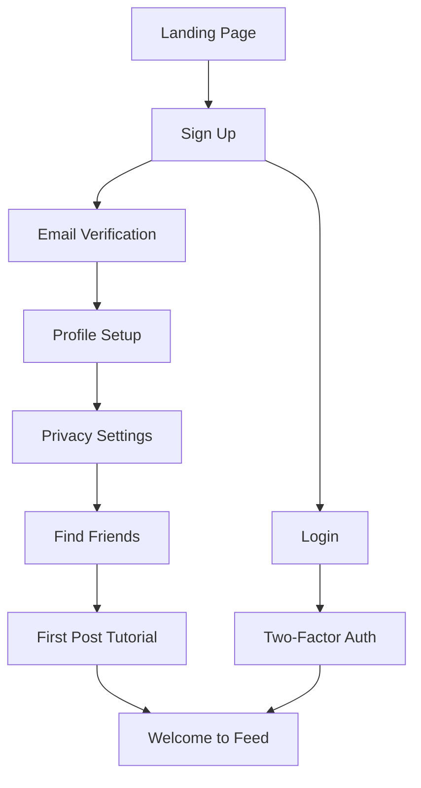
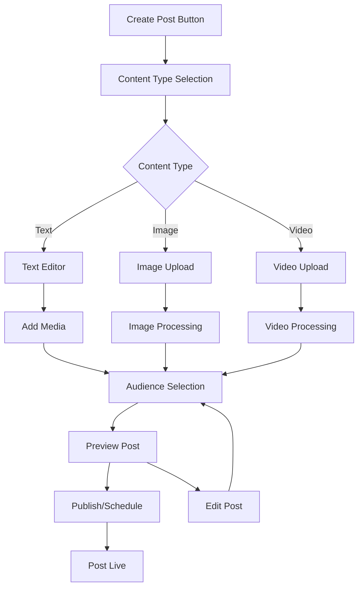
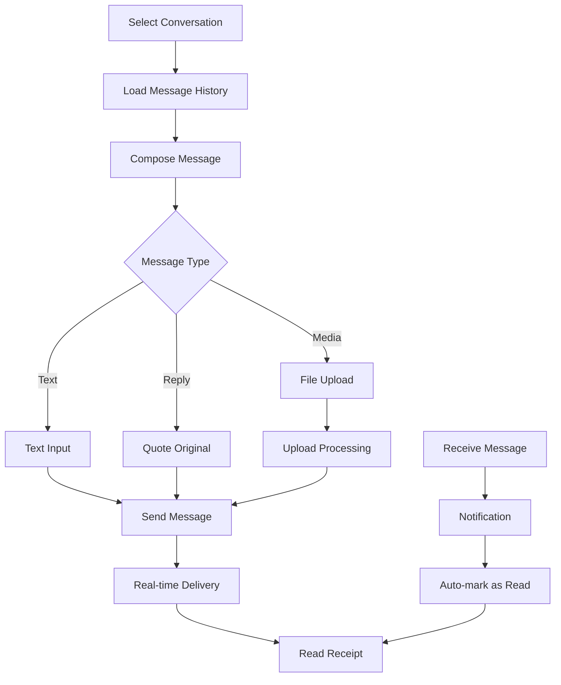
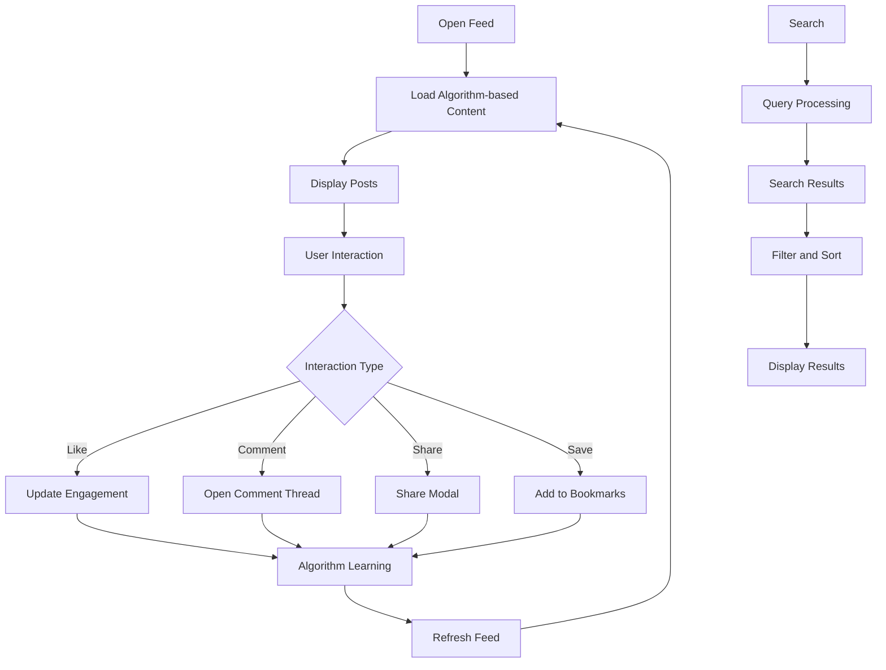

# SocialConnect - Functional Documentation

## Table of Contents

1. [Overview](#overview)
2. [User Roles and Permissions](#user-roles-and-permissions)
3. [Core Features](#core-features)
4. [User Workflows](#user-workflows)
5. [Business Logic](#business-logic)
6. [User Interface](#user-interface)
7. [Content Management](#content-management)
8. [Privacy and Security](#privacy-and-security)
9. [Social Interactions](#social-interactions)
10. [Real-time Communication](#real-time-communication)
11. [Notification System](#notification-system)
12. [Content Moderation](#content-moderation)
13. [Analytics and Reporting](#analytics-and-reporting)
14. [Mobile Experience](#mobile-experience)
15. [Accessibility](#accessibility)

## Overview

SocialConnect is a comprehensive social media platform designed to facilitate meaningful connections, content sharing, and real-time communication among users. The platform emphasizes user privacy, content quality, and community building through modern web technologies and intuitive user experiences.

### Platform Mission
- **Connect**: Enable users to build and maintain social connections
- **Share**: Provide rich content creation and sharing capabilities
- **Engage**: Foster meaningful interactions and community engagement
- **Protect**: Ensure user privacy and data security
- **Innovate**: Deliver cutting-edge social media features

### Target Audience
- **Primary**: Social media enthusiasts aged 16-45
- **Secondary**: Content creators and influencers
- **Tertiary**: Businesses and organizations seeking social presence

## User Roles and Permissions

### User Types

#### 1. Regular User
**Permissions:**
- Create and manage personal profile
- Post content (text, images, videos)
- Share stories with 24-hour expiration
- Like, comment, and share posts
- Follow/unfollow other users
- Send and receive direct messages
- Join group conversations
- Bookmark posts for later viewing
- Report inappropriate content
- Customize privacy settings

**Limitations:**
- Cannot access admin features
- Limited to standard posting quotas
- Cannot moderate community content

#### 2. Verified User
**Additional Permissions:**
- Verified badge on profile
- Enhanced visibility in search results
- Priority customer support
- Advanced analytics access
- Higher posting limits

**Requirements:**
- Identity verification process
- Minimum follower threshold
- Account in good standing

#### 3. Content Creator
**Additional Permissions:**
- Creator studio access
- Advanced content analytics
- Monetization features (future)
- Live streaming capabilities (future)
- Collaboration tools

#### 4. Administrator
**Full Permissions:**
- User account management
- Content moderation
- Platform configuration
- Analytics dashboard access
- System monitoring

### Permission Matrix

| Feature | Regular User | Verified User | Creator | Admin |
|---------|--------------|---------------|---------|-------|
| Profile Creation | ✅ | ✅ | ✅ | ✅ |
| Post Content | ✅ | ✅ | ✅ | ✅ |
| Stories | ✅ | ✅ | ✅ | ✅ |
| Messaging | ✅ | ✅ | ✅ | ✅ |
| Advanced Analytics | ❌ | ✅ | ✅ | ✅ |
| Verification Badge | ❌ | ✅ | ✅ | ✅ |
| Content Moderation | ❌ | ❌ | ❌ | ✅ |
| User Management | ❌ | ❌ | ❌ | ✅ |
| System Configuration | ❌ | ❌ | ❌ | ✅ |

## Core Features

### 1. User Management
**Registration and Authentication**
- Email-based registration with verification
- Username uniqueness validation
- Secure password requirements
- Social login options (Google, Facebook) - *Future*
- Two-factor authentication - *Future*
- Password reset via email

**Profile Management**
- Personal information (display name, bio, location)
- Profile and cover photo upload
- Privacy settings configuration
- Account verification process
- Profile visibility controls

### 2. Content Creation and Sharing
**Posts**
- Rich text content with formatting
- Multiple image uploads (up to 10 per post)
- Video uploads with compression
- Link previews with metadata
- Post visibility settings (Public, Friends, Private)
- Content scheduling - *Future*
- Post editing and deletion

**Stories**
- 24-hour disappearing content
- Image and video stories
- Story viewers tracking
- Story highlights - *Future*
- Story reactions - *Future*

**Media Handling**
- Automatic image optimization
- Video compression and thumbnails
- Progressive image loading
- Multi-format support (JPEG, PNG, WebP, MP4, etc.)

### 3. Social Interactions
**Engagement Features**
- Like/unlike posts and comments
- Commenting with nested replies
- Post sharing (internal and external)
- Content bookmarking
- Reaction emojis - *Future*

**Social Connections**
- Follow/unfollow users
- Mutual follower detection
- Friend suggestions algorithm
- User blocking and reporting
- Following/followers lists

### 4. Real-time Communication
**Direct Messaging**
- One-on-one conversations
- Group messaging (up to 50 participants)
- Media sharing in messages
- Message reactions - *Future*
- Voice messages - *Future*
- Video calls - *Future*

**Live Features**
- Typing indicators
- Online status indicators
- Message read receipts
- Real-time notifications
- Live story viewing

### 5. Discovery and Search
**Content Discovery**
- Personalized feed algorithm
- Trending posts and hashtags
- User recommendations
- Content categories
- Popular creators spotlight

**Search Functionality**
- User search by username or display name
- Content search with filters
- Hashtag exploration
- Location-based discovery - *Future*

### 6. Privacy and Security
**Privacy Controls**
- Granular visibility settings
- Content audience selection
- Message privacy controls
- Data download and deletion
- Activity log and privacy dashboard

**Security Features**
- End-to-end encryption for messages - *Future*
- Secure file upload validation
- Rate limiting and spam protection
- Suspicious activity detection
- Account security notifications

## User Workflows

### 1. User Onboarding Workflow



**Step-by-Step Process:**

1. **Landing Page**
   - User views platform introduction
   - Call-to-action for registration
   - Login option for existing users

2. **Registration**
   - Email and username input
   - Password creation with strength meter
   - Terms of service acceptance
   - CAPTCHA verification

3. **Email Verification**
   - Verification email sent
   - Link click confirmation
   - Account activation

4. **Profile Setup**
   - Display name and bio entry
   - Profile photo upload (optional)
   - Location and interests (optional)

5. **Privacy Configuration**
   - Default privacy settings explanation
   - Audience selection for posts
   - Message privacy preferences

6. **Social Discovery**
   - Contact list import (optional)
   - Friend suggestions
   - Popular users to follow

7. **First Post Experience**
   - Guided post creation tutorial
   - Feature highlights
   - Community guidelines

### 2. Content Creation Workflow



**Detailed Steps:**

1. **Initiation**
   - User clicks "Create Post" button
   - Post composer modal opens
   - Content type selection available

2. **Content Creation**
   - Text input with formatting options
   - Media upload with drag-and-drop
   - Link attachment with preview
   - Hashtag and mention suggestions

3. **Media Processing**
   - Automatic image optimization
   - Video compression and thumbnail generation
   - Alt text for accessibility
   - Content validation and scanning

4. **Audience Configuration**
   - Visibility setting selection
   - Specific user/group targeting
   - Geographic restrictions (future)

5. **Review and Publish**
   - Post preview with all elements
   - Final content review
   - Publish immediately or schedule
   - Success confirmation

### 3. Message Exchange Workflow



**Message Lifecycle:**

1. **Conversation Selection**
   - User selects existing conversation
   - Or starts new conversation with user search
   - Conversation history loads with pagination

2. **Message Composition**
   - Text input with emoji picker
   - Media attachment options
   - Reply-to-message functionality
   - Draft auto-save

3. **Message Sending**
   - Real-time validation
   - Delivery confirmation
   - Typing indicator broadcast
   - Message encryption (future)

4. **Message Reception**
   - Real-time message delivery
   - Push notification trigger
   - Unread count update
   - Auto-read when conversation active

### 4. Content Discovery Workflow



**Discovery Process:**

1. **Feed Generation**
   - Algorithm analyzes user preferences
   - Content from followed users (70%)
   - Popular content discovery (20%)
   - Recommended content (10%)

2. **Content Presentation**
   - Infinite scroll implementation
   - Media lazy loading
   - Engagement metrics display
   - Sponsored content integration (future)

3. **User Interaction Tracking**
   - Like/unlike actions
   - Comment engagement
   - Share behavior
   - Time spent viewing
   - Content saves

4. **Algorithm Adaptation**
   - Engagement pattern analysis
   - Content preference learning
   - Social graph influence
   - Trending topic integration

## Business Logic

### 1. Content Visibility Rules

**Public Posts**
- Visible to all users
- Searchable and discoverable
- Can be shared externally
- Appear in public feeds

**Friends-Only Posts**
- Visible only to followers
- Not searchable by non-followers
- Limited sharing options
- Excluded from public discovery

**Private Posts**
- Visible only to post author
- Not searchable or shareable
- Used for drafts and personal notes
- Excluded from all feeds

### 2. Following and Follower Logic

**Following Rules**
- Users can follow unlimited accounts
- Instant follow for public accounts
- Follow requests for private accounts
- Mutual follow creates "friend" status

**Follower Management**
- Users can remove followers
- Block users to prevent following
- Private accounts approve followers
- Follower limits for spam prevention

### 3. Content Recommendation Algorithm

**Feed Algorithm Factors**
1. **Recency Score (30%)**
   - Time since post creation
   - Exponential decay over 24 hours

2. **Social Relevance (40%)**
   - Posts from followed users
   - Mutual friend interactions
   - Similar interest users

3. **Engagement Score (20%)**
   - Like/comment ratio
   - Share frequency
   - User interaction history

4. **Content Quality (10%)**
   - Media presence
   - Text length and quality
   - Hashtag relevance

**Calculation Formula:**
```
Post Score = (Recency × 0.3) + (Social × 0.4) + (Engagement × 0.2) + (Quality × 0.1)
```

### 4. Notification Rules

**Real-time Notifications**
- New messages (immediate)
- Live interactions (likes, comments)
- Follow requests
- Mentions in posts/comments

**Batched Notifications**
- Daily activity summaries
- Weekly engagement reports
- Friend suggestions
- Trending content alerts

**Notification Frequency Limits**
- Maximum 50 notifications per hour
- Grouped similar notifications
- User preference controls
- Do-not-disturb periods

## User Interface

### 1. Navigation Structure

**Desktop Layout**
```
┌─────────────────────────────────────────────────────┐
│ Header: Logo | Search | Notifications | User Menu   │
├─────────────┬─────────────────────┬─────────────────┤
│ Sidebar:    │ Main Content Area   │ Right Sidebar:  │
│ - Home      │ - Feed              │ - Trending      │
│ - Profile   │ - Post Details      │ - Suggestions   │
│ - Messages  │ - User Profiles     │ - Who to Follow │
│ - Settings  │ - Search Results    │ - Ads (Future)  │
│ - More      │                     │                 │
└─────────────┴─────────────────────┴─────────────────┘
```

**Mobile Layout**
```
┌─────────────────────────────────────┐
│ Header: Logo | Search | Menu Button │
├─────────────────────────────────────┤
│                                     │
│         Main Content Area           │
│                                     │
├─────────────────────────────────────┤
│ Bottom Nav: Home|Search|+|♡|Profile │
└─────────────────────────────────────┘
```

### 2. Component Design System

**Color Palette**
- Primary: Blue (#3B82F6)
- Secondary: Gray (#6B7280)
- Success: Green (#10B981)
- Warning: Yellow (#F59E0B)
- Error: Red (#EF4444)
- Background: White (#FFFFFF)
- Surface: Light Gray (#F9FAFB)

**Typography Scale**
- Headline: 32px, Bold
- Title: 24px, Semi-bold
- Subtitle: 20px, Medium
- Body: 16px, Regular
- Caption: 14px, Regular
- Small: 12px, Regular

**Spacing System**
- XS: 4px
- SM: 8px
- MD: 16px
- LG: 24px
- XL: 32px
- 2XL: 48px

### 3. Interactive Elements

**Buttons**
- Primary: Blue background, white text
- Secondary: Gray border, black text
- Text: No background, blue text
- Icon: Square, gray background

**Forms**
- Input fields with floating labels
- Validation feedback in real-time
- Error states with descriptive messages
- Success states with confirmation

**Modals**
- Centered overlay with backdrop
- Smooth slide-in animation
- Close button and escape key support
- Mobile-responsive design

### 4. Responsive Design Breakpoints

**Mobile First Approach**
- Mobile: 320px - 767px
- Tablet: 768px - 1023px
- Desktop: 1024px - 1439px
- Large Desktop: 1440px+

**Adaptive Features**
- Navigation collapses to hamburger menu
- Sidebar becomes overlay on mobile
- Touch-friendly button sizes (44px minimum)
- Swipe gestures for mobile interactions

## Content Management

### 1. Post Creation Guidelines

**Content Standards**
- Maximum post length: 2,000 characters
- Image limits: 10 images per post
- Video limits: 1 video per post, 100MB max
- Supported formats: JPEG, PNG, WebP, MP4, MOV
- Automatic content optimization

**Content Restrictions**
- No explicit sexual content
- No hate speech or harassment
- No violence or graphic content
- No spam or repetitive content
- No copyright violations

### 2. Media Processing Pipeline

**Image Processing**
1. **Upload Validation**
   - File type verification
   - Size limit enforcement (10MB max)
   - Virus scanning
   - Metadata extraction

2. **Optimization**
   - Automatic format conversion to WebP
   - Multiple resolution generation
   - Compression based on content type
   - Progressive loading preparation

3. **Storage and CDN**
   - Cloud storage upload (Cloudinary)
   - CDN distribution
   - Backup creation
   - URL generation

**Video Processing**
1. **Upload and Validation**
   - Format support check
   - Duration limits (5 minutes max)
   - Size validation (100MB max)
   - Content scanning

2. **Transcoding**
   - Multiple quality options (480p, 720p, 1080p)
   - Thumbnail generation
   - Preview clip creation
   - Audio normalization

3. **Delivery Optimization**
   - Adaptive bitrate streaming
   - CDN distribution
   - Mobile-optimized formats
   - Progressive download

### 3. Content Moderation Pipeline

**Automated Moderation**
1. **Text Analysis**
   - Profanity detection
   - Hate speech identification
   - Spam pattern recognition
   - Language detection

2. **Image Analysis**
   - NSFW content detection
   - Violence and gore identification
   - Brand logo recognition
   - Duplicate content detection

3. **Video Analysis**
   - Scene classification
   - Audio content analysis
   - Duration validation
   - Copyright detection

**Human Moderation**
- Review flagged content
- Appeal process handling
- Community guideline updates
- Moderator training and tools

### 4. Content Archival and Deletion

**Soft Delete Process**
- Content marked as deleted but preserved
- 30-day recovery period
- User notification of deletion
- Automatic hard delete after period

**Hard Delete Process**
- Complete content removal
- CDN cache purging
- Database record deletion
- Backup system cleanup

## Privacy and Security

### 1. Privacy Controls

**Profile Privacy**
- Public profile visibility
- Private account mode
- Selective information sharing
- Search visibility controls

**Content Privacy**
- Post audience selection
- Story viewer restrictions
- Comment visibility rules
- Download prevention options

**Communication Privacy**
- Message encryption in transit
- Conversation participant limits
- Message forwarding controls
- Screenshot notifications (future)

### 2. Data Protection

**Data Collection Principles**
- Minimal data collection
- Purpose limitation
- User consent required
- Transparent data usage

**User Rights**
- Data access requests
- Data portability
- Account deletion
- Consent withdrawal

**Data Retention Policy**
- Active user data: Indefinite
- Inactive accounts: 2 years
- Deleted content: 30 days
- Analytics data: 1 year

### 3. Security Measures

**Account Security**
- Strong password requirements
- Account lockout after failed attempts
- Suspicious activity monitoring
- Security notification system

**Data Security**
- Encryption at rest and in transit
- Regular security audits
- Penetration testing
- Vulnerability management

**Infrastructure Security**
- Secure cloud hosting
- Regular backup procedures
- Disaster recovery planning
- Access control management

## Social Interactions

### 1. Engagement Mechanics

**Like System**
- Single tap to like/unlike
- Like count display
- Liker list viewing
- Like notification to author

**Comment System**
- Threaded comment structure
- Comment editing (5-minute window)
- Comment deletion by author/admin
- Comment moderation tools

**Sharing Features**
- Internal post sharing
- External platform sharing
- Share with specific users
- Share via direct message

**Bookmark System**
- Private content saving
- Bookmark organization (future)
- Bookmark search functionality
- Export bookmarks option

### 2. Social Graph Management

**Following System**
- Instant follow for public accounts
- Follow request for private accounts
- Mutual follow detection
- Follow suggestion algorithm

**Blocking and Reporting**
- User blocking with complete isolation
- Content reporting with categories
- Automated action on reports
- Appeal process for blocks

**Social Discovery**
- Friend suggestions based on:
  - Mutual connections
  - Contact list matching
  - Similar interests
  - Geographic proximity (future)

### 3. Community Features

**Groups and Communities** (Future)
- Interest-based groups
- Moderated discussions
- Event organization
- Resource sharing

**User Verification**
- Identity verification process
- Blue checkmark badge
- Enhanced profile features
- Priority support access

## Real-time Communication

### 1. Messaging Features

**Conversation Types**
- Direct messages (1-on-1)
- Group conversations (up to 50 users)
- Broadcast messages (future)
- Disappearing messages (future)

**Message Types**
- Text messages with emoji support
- Image and video sharing
- File attachments (future)
- Voice messages (future)
- Location sharing (future)

**Conversation Management**
- Message search functionality
- Conversation archiving
- Message deletion (for self)
- Conversation muting

### 2. Real-time Indicators

**Typing Indicators**
- Show when user is typing
- Multiple user typing support
- Automatic timeout after 3 seconds
- Privacy control option

**Online Status**
- Green dot for online users
- Last seen timestamp
- Privacy control for status
- Invisible mode option

**Read Receipts**
- Message delivery confirmation
- Read status indication
- Timestamp display
- Disable option available

### 3. Notification System

**Push Notifications**
- New message alerts
- Mention notifications
- Follow request notifications
- Post interaction alerts

**In-App Notifications**
- Real-time notification center
- Notification categorization
- Mark as read functionality
- Notification history

**Email Notifications**
- Daily/weekly digest options
- Important activity alerts
- Security notifications
- Marketing communications (opt-in)

## Notification System

### 1. Notification Types

**Engagement Notifications**
- New followers
- Post likes and comments
- Story views
- Mention in posts/comments
- Share notifications

**Communication Notifications**
- New direct messages
- Group message mentions
- Message reactions (future)
- Voice call invitations (future)

**System Notifications**
- Security alerts
- Policy updates
- Feature announcements
- Maintenance notifications

### 2. Notification Delivery

**Real-time Delivery**
- WebSocket for instant notifications
- Browser push notifications
- Mobile app notifications (future)
- Desktop notifications

**Batched Delivery**
- Digest emails (daily/weekly)
- Summary notifications
- Trending content alerts
- Recommendation updates

### 3. Notification Management

**User Controls**
- Notification type toggles
- Delivery method preferences
- Quiet hours settings
- Priority contact settings

**Smart Bundling**
- Group similar notifications
- Reduce notification spam
- Intelligent timing
- Context-aware delivery

## Content Moderation

### 1. Automated Moderation

**Content Scanning**
- AI-powered text analysis
- Image content detection
- Video scene analysis
- Audio content monitoring

**Violation Detection**
- Hate speech identification
- Spam pattern recognition
- NSFW content flagging
- Copyright infringement detection

**Automated Actions**
- Content hiding/removal
- User warnings
- Temporary restrictions
- Account suspensions

### 2. Human Moderation

**Review Process**
- Flagged content queue
- Priority-based review
- Context consideration
- Appeal handling

**Moderation Tools**
- Content review dashboard
- User history analysis
- Bulk action capabilities
- Collaboration features

**Training and Guidelines**
- Moderator certification
- Regular guideline updates
- Consistent decision making
- Performance monitoring

### 3. Community Reporting

**Report Categories**
- Harassment and bullying
- Hate speech
- Violence and threats
- Spam and fake accounts
- Intellectual property
- Other violations

**Report Processing**
- Automated triage
- Priority assessment
- Investigation process
- Resolution communication

**Appeal System**
- User appeal submission
- Review by different moderator
- Decision explanation
- Resolution tracking

## Analytics and Reporting

### 1. User Analytics

**Engagement Metrics**
- Post reach and impressions
- Like and comment rates
- Share and save statistics
- Story view analytics
- Profile visit tracking

**Audience Insights**
- Follower demographics
- Geographic distribution
- Activity patterns
- Interest analysis
- Growth trends

**Content Performance**
- Top performing posts
- Content type analysis
- Optimal posting times
- Hashtag effectiveness
- Engagement patterns

### 2. Platform Analytics

**Usage Statistics**
- Daily/monthly active users
- Session duration
- Feature usage patterns
- Content creation rates
- User retention metrics

**Growth Metrics**
- New user registration
- User activation rates
- Churn analysis
- Referral tracking
- Platform health indicators

**Performance Monitoring**
- System response times
- Error rates
- Uptime statistics
- Resource utilization
- Scalability metrics

### 3. Business Intelligence

**Revenue Analytics** (Future)
- Advertising revenue
- Subscription metrics
- Creator economy data
- Monetization effectiveness

**Trend Analysis**
- Emerging topics
- Viral content patterns
- User behavior trends
- Market opportunities

**Competitive Analysis**
- Feature comparison
- User migration patterns
- Market positioning
- Industry benchmarks

## Mobile Experience

### 1. Progressive Web App (PWA)

**PWA Features**
- Offline functionality
- App-like experience
- Home screen installation
- Background sync
- Push notifications

**Performance Optimization**
- Service worker caching
- Critical path optimization
- Lazy loading implementation
- Bundle size optimization
- Network-aware features

### 2. Mobile-Specific Features

**Touch Interactions**
- Swipe gestures for navigation
- Pull-to-refresh functionality
- Long press context menus
- Haptic feedback (future)
- Voice input support (future)

**Camera Integration**
- Direct photo capture
- Video recording
- Story creation tools
- Filter applications (future)
- AR effects (future)

**Location Services** (Future)
- Location tagging
- Nearby users discovery
- Location-based content
- Check-in functionality

### 3. Cross-Platform Compatibility

**Browser Support**
- Chrome/Chromium (primary)
- Safari/WebKit
- Firefox/Gecko
- Edge/Blink
- Progressive enhancement

**Device Adaptation**
- Responsive design principles
- Touch-friendly interfaces
- Orientation handling
- Keyboard accessibility
- Screen reader support

## Accessibility

### 1. WCAG Compliance

**Level AA Standards**
- Keyboard navigation support
- Screen reader compatibility
- Color contrast requirements
- Text scaling support
- Focus management

**Accessibility Features**
- Alt text for images
- ARIA labels and roles
- Semantic HTML structure
- Skip navigation links
- Error message clarity

### 2. Assistive Technology

**Screen Reader Support**
- VoiceOver (iOS/macOS)
- TalkBack (Android)
- NVDA (Windows)
- JAWS (Windows)
- Dragon NaturallySpeaking

**Keyboard Navigation**
- Tab order management
- Keyboard shortcuts
- Focus indicators
- Modal navigation
- Menu accessibility

### 3. Inclusive Design

**Visual Accessibility**
- High contrast mode
- Large text support
- Color blindness consideration
- Motion reduction options
- Zoom compatibility

**Cognitive Accessibility**
- Clear navigation structure
- Consistent interface elements
- Simple language usage
- Error prevention
- Progress indicators

**Motor Accessibility**
- Large click targets
- Gesture alternatives
- Voice control support
- Switch navigation
- Timing adjustments

---

## User Stories and Scenarios

### Core User Stories

**As a new user, I want to:**
- Create an account quickly and securely
- Set up my profile with personal information
- Find and connect with friends and interesting people
- Learn how to use the platform effectively

**As a content creator, I want to:**
- Share high-quality posts with my audience
- Track engagement and reach metrics
- Build a following through discoverable content
- Interact with my community through comments and messages

**As a social media consumer, I want to:**
- Discover relevant and interesting content
- Stay updated with friends' activities
- Engage with content through likes, comments, and shares
- Have meaningful conversations with other users

**As a privacy-conscious user, I want to:**
- Control who can see my content and profile
- Manage my data and privacy settings
- Report inappropriate behavior
- Delete my account and data when needed

### Detailed Scenarios

#### Scenario 1: New User Onboarding
**Context:** Sarah, a 25-year-old professional, wants to join SocialConnect to stay connected with college friends.

**Journey:**
1. Sarah visits the platform and clicks "Sign Up"
2. She enters her email, creates a username, and sets a secure password
3. She receives a verification email and clicks the confirmation link
4. Sarah uploads a profile photo and writes a short bio
5. She adjusts privacy settings to make her profile public
6. The platform suggests friends based on her contacts (with permission)
7. Sarah follows 5 suggested users and creates her first post
8. She receives a welcome notification and tutorial tips

**Success Criteria:**
- Account creation completed in under 5 minutes
- At least 3 connections made during onboarding
- First post published successfully
- Privacy settings configured according to preferences

#### Scenario 2: Content Creation and Engagement
**Context:** Marcus, a freelance photographer, wants to share his latest photo series and engage with his audience.

**Journey:**
1. Marcus opens the app and taps "Create Post"
2. He selects multiple photos from his latest shoot
3. He writes a detailed caption with relevant hashtags
4. Marcus sets the post visibility to "Public" for maximum reach
5. He schedules the post for optimal engagement time
6. The post goes live and starts receiving likes and comments
7. Marcus responds to comments and shares stories about his work
8. He checks analytics to see post performance

**Success Criteria:**
- Photo upload completed without quality loss
- Post receives engagement within first hour
- Comments facilitate meaningful conversations
- Analytics provide valuable insights for future content

#### Scenario 3: Real-time Communication
**Context:** Lisa wants to coordinate a group trip with friends through the platform's messaging feature.

**Journey:**
1. Lisa creates a new group conversation with 8 friends
2. She shares trip details and asks for input on dates
3. Friends respond in real-time with their availability
4. Lisa shares photos of potential destinations
5. The group decides on dates and location through discussion
6. Lisa pins important messages for easy reference
7. She sets up reminders and creates a shared checklist
8. The group stays connected throughout the planning process

**Success Criteria:**
- Group conversation created with all participants
- Real-time messaging works seamlessly
- Media sharing enhances communication
- Group reaches consensus on trip plans

#### Scenario 4: Privacy and Security Management
**Context:** David, a public figure, needs to manage his online presence while maintaining privacy for personal content.

**Journey:**
1. David sets his main account to "Public" for professional content
2. He creates separate privacy settings for personal posts
3. David blocks unwanted followers and reporters
4. He uses the "Close Friends" feature for personal updates
5. David regularly reviews his privacy settings
6. He reports harassment from anonymous accounts
7. The platform takes action on reported violations
8. David feels secure sharing both professional and personal content

**Success Criteria:**
- Privacy settings work as intended
- Unwanted contact is prevented through blocking
- Reporting system addresses harassment effectively
- David maintains control over his content visibility

---

*This functional documentation provides a comprehensive overview of SocialConnect's features, workflows, and user experience. It serves as a guide for developers, designers, and stakeholders to understand the platform's intended functionality and user interactions.*